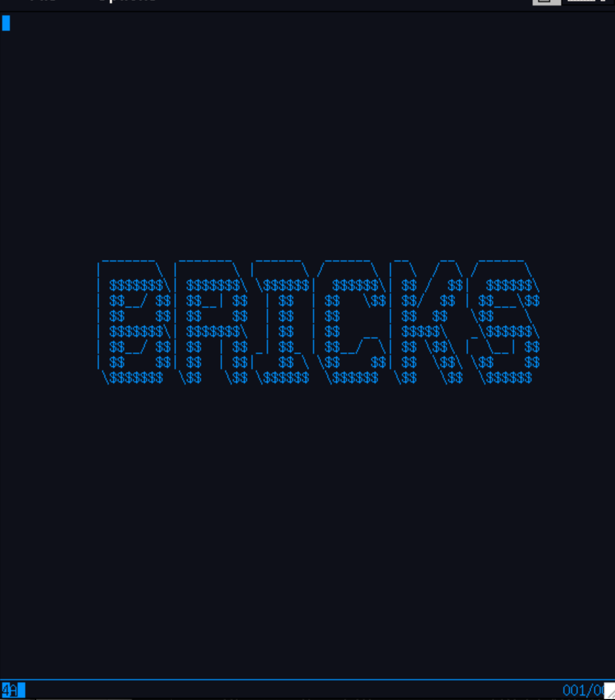

# Bricks Transaction Server

A Go implementation of an IBM CICS-compatible 3270 transaction server. Users
dial in with a 3270 terminal emulator, sign on via a built-in CSSN screen, and
run REXX or COBOL programs whose `EXEC CICS` commands are interpreted by
built-in REXX and COBOL VMs with `EXEC CICS` handlers backed by an on-disk
record store.

Chat with BRICKS users and administrators [here](https://discord.gg/6NWE4Gp7kR)

Both REXX and COBOL dialects, and their interpreter implementations, are
original — not related to BREXX or Regina. The `EXEC CICS` surface is
compatible with CICS, and the supported verb set is enough to run
pseudo-conversational and conversational programs as usual.

Bricks also features a built-in VSAM-style KSDS access method whose records
are stored inside a single bbolt database for easy management and backup.

COBOL and REXX programs are parsed once and then cached, so repeat dispatches
skip the lex+parse cost. Each instantiated program has its own heap and stack,
so there are no re-entrancy issues. Bricks expressly disallows calculated
GOTOs in COBOL programs for the same reason.

> **Application programmers:** see **[PROGRAMMING.md](PROGRAMMING.md)** —
> the *Bricks Application Programming Reference*. It documents the
> BMS-flavoured map DSL, every supported `EXEC CICS` command (format,
> options, conditions, examples), the REXX dialect, the COBOL dialect, and
> sample programs.
>
> This README covers **running and operating** bricks: configuration,
> authentication, control blocks, on-disk file storage, the operator
> console, CEMT, the `/metrics` endpoint, the embedder API, the CLI
> utilities, the test suite, the `bricksload` stress tester, and
> performance / security hardening.

---

## Quick start

```sh
# Add a user (admin / admin already exists in runtime/users.conf).
./add_brick_user.bash alice "alice's-password" admin,users

# Run the server. Edit bricks.cnf first (see "Configuration").
./bricks --conf=bricks.cnf

# Connect with any 3270 emulator (c3270, x3270, tn3270 …):
c3270 -port 2300 localhost
```

On connect you'll see the `bricks.logo` splash in blue. Press ENTER to reach
the TRANSID prompt; type `CSSN` to sign on, then any defined TRANSID
(e.g. `HELO`).

---

## Configuration — `bricks.cnf`

Key=value, one per line, `#` for comments. Keys are case-insensitive.

| Key                          | Default                       | Notes |
|------------------------------|-------------------------------|-------|
| `port`                       | `2300`                        | Plain-TCP listener. |
| `tlsport`                    | `2023`                        | Used only when `start_TLS=yes`. |
| `start_TLS`                  | `no`                          | `yes` requires `tlscert` + `tlskey`. |
| `enforce_secure_login`       | `no`                          | `yes` blocks every TRANSID except the logon TRANSID until the session is authenticated. |
| `tlscert`                    | (none)                        | Path to PEM cert. |
| `tlskey`                     | (none)                        | Path to PEM key. |
| `secure_login_transacton`    | `CSSN`                        | The 4-character logon TRANSID. Built-in `CSSN` is implemented in Go; any other value must exist in `transactions.conf`. Misspelling preserved for back-compat; `secure_login_transaction` and `logon_transid` are also accepted. |
| `users_file`                 | `runtime/users.conf`          | Auth source. |
| `transactions_file`          | `runtime/transactions.conf`   | TRANSID dispatch table. |
| `maps_dir`                   | `runtime/map`                 | Directory of `*.map` files. |
| `rexx_dir`                   | `runtime/rexx`                | Directory of REXX programs. |
| `cobol_dir`                  | `runtime/cobol`               | Directory of COBOL programs. |
| `data_dir`                   | `data`                        | Holds `files.boltdb` (FILE store + TS queues). |
| `tmp_dir`                    | `runtime/tmp`                 | Sandbox directory for sequential text I/O (REXX `LINEIN`/`LINEOUT`, COBOL `READQ TD`/`WRITEQ TD`). Strict: ASCII only, LF-terminated, flat namespace, no traversal. See [Sequential file I/O — `tmp_dir`](#sequential-file-io--tmp_dir). |
| `ntp_server`                 | `time.google.com`             | NTP server polled every 5 minutes to correct bricks's in-memory wall clock. EIBTIME / EIBDATE / FORMATTIME consult this corrected clock. Set to `off` to disable. Failures are non-fatal — bricks logs and continues with the previous offset (or the raw host clock if no sync has ever succeeded). See [Time synchronisation](#time-synchronisation). |
| `time_zone`                  | `Z` (UTC)                     | Military zone letter (`Z`=UTC, `A`–`M`=UTC+1..+12, `N`–`Y`=UTC-1..-12). Applies to operator-visible time fields; ABSTIME stays UTC milliseconds. See [Time synchronisation](#time-synchronisation). |
| `log_location`               | `log`                         | Directory where bricks writes per-run log files. On startup a new file `YYYY-MM-DD_HH-MM-SS.log` is created; every console line is appended (with ANSI color stripped) and prefixed with a 4-character subsystem tag. Set to `off` to disable file logging. See [Logging](#logging). |
| `idle_timeout_secs`          | `900`                         | Read deadline applied **only before sign-on** — to the LogonPrompt and to the BlankPrompt of an unauthenticated session, plus the CSSN sign-on input reads. A peer that completes telnet negotiation but never signs on is dropped after this many seconds so a half-open handshake doesn't tie up a `max_conns_per_ip` slot forever. **Once the operator has signed on, the deadline is not set** — a signed-on terminal sits at the blank prompt indefinitely and only disconnects on TCP close or an explicit `CSSF DISC` / `DISCONNECT` / `GOODNIGHT`. `CSSF LOGOFF` clears the authentication flag, so the deadline resumes for the now-unauthenticated session. |
| `max_conns_per_ip`           | `8`                           | Per-client cap. |
| `program_cache`              | `4`                           | L2 LRU pool size in MB for parsed REXX/COBOL programs (a 128-entry L1 of decoded ASTs sits in front of it). Allocated once at startup as eight contiguous byte slabs — one per shard — and reused for the life of the process; Go's GC never scans the program bytes. Valid range is `1..16384` (1 MB floor, 16 GB cap); out-of-range values are rejected at startup. Live counters for both tiers are visible in `CEMT MONITOR`. |
| `banner`                     | `BRICKS Transaction Server`   | Shown at top of system screens. |
| `dns_name`                   | (none)                        | Informational; printed at startup. |
| `start_web3270`              | `no`                          | `yes` enables the in-process browser-based 3270 emulator. |
| `web3270_port`               | `9000`                        | HTTP port for the web3270 frontend (only used when `start_web3270=yes`). |
| `start_metrics`              | `yes`                         | `yes` exposes a JSON `/metrics` endpoint with runtime + counter snapshots. Independent of `start_web3270`. |
| `metrics_port`               | `9100`                        | HTTP port for the dedicated `/metrics` listener. The same route is also mounted on the web3270 listener when both are on. |

Command-line flags (in addition to `--conf`):

| Flag             | Notes |
|------------------|-------|
| `--no-console`   | Disable the framed operator console; emit raw `log.Printf` lines on stderr. Use under `nohup` / `systemd` / when piping through `tee`. |

---

## Authentication procedure

The connection lifecycle is owned by `main.go::handle()`:

1. **Accept** — telnet/3270 negotiation runs (`tn3270.Negotiate`); device size
   and codepage are captured.
2. **TCB** — a fresh `session.TCB` is created with a unique `TermID` (T0001,
   T0002, …) and registered in the global `session.Registry`.
   `Authenticated` is `false`.
3. **Splash** — `tn3270.ShowLogoSplash` paints `bricks.logo` in blue,
   centered. No input fields. Returns when the user presses any AID.
4. **Logon prompt** — `tn3270.LogonPrompt` shows the logo plus a TRANSID
   input field. When `enforce_secure_login=yes` and the session is not yet
   authenticated, a blue notice on row 0 reads `Sign on with <transid> to
   continue.`. PF3 / CLEAR / PA1-3 disconnect.
5. **Auth gate** —
   * If the typed TRANSID equals `secure_login_transacton`, the configured
     logon flow runs. The default `CSSN` is built into `auth/cssn.go`: it
     loads `runtime/map/cssn.map`, prompts for userid+password, looks the user up in
     `runtime/users.conf`, verifies the bcrypt hash with `golang.org/x/crypto/bcrypt`,
     and on success sets `tcb.UserID`, `tcb.Groups`, `tcb.Authenticated=true`,
     and attaches the TCB to a UCB via `Registry.AttachUserToTerminal`.
     Failures bump `Registry.AuthFailure` and re-prompt — but only
     up to a per-session cap. After **3 consecutive failed credential
     checks** on the same TCP connection, `RunCSSN` logs
     `term=Tnnnn disconnecting after 3 failed sign-on attempts` and
     returns `ErrDisconnect`; `main.go::handle` then drops the
     connection. The counter does not advance on usage errors like
     an empty userid (the operator gets to correct the form without
     burning an attempt), and it resets the next time the peer
     reconnects. The cap lives at `auth.MaxSignonFailures`.
   * Otherwise, if `enforce_secure_login=yes` and the session is not
     authenticated, the dispatcher is bypassed and the user is shown
     `Not signed on. Run <logon> first.` then sent back to the prompt.
   * Else the dispatcher runs the TRANSID.
6. **Dispatch** — `txn.Dispatcher.Run` chains through `tcb.NextTransid` after
   each `EXEC CICS RETURN TRANSID(...)`. When the next TRANSID is empty,
   control returns to step 4. Before each dispatch the per-transaction
   ACL gate fires (see [Per-transaction ACL](#per-transaction-acl)
   below); a denied dispatch shows `TRANSID "X": access denied -- ...`
   on the operator screen and logs the user / groups / required list
   to the console for grep.
7. **Sign off** — typing `CSSF LOGOFF` (any case; argument required) at the
   blank prompt detaches the UCB via
   `Registry.DetachUserFromTerminal(tcb)`, clears `tcb.UserID` and
   `tcb.Authenticated`, and sends the terminal back to the unauthenticated
   logon prompt. **The TCP connection stays open**: only the user's TCP
   close cuts it. Bare ENTER, PF3, CLEAR, and PA1-3 at the blank prompt
   redisplay the same screen — they no longer disconnect.
8. **Disconnect** — `defer registry.RemoveTerminal(tcb)` drops the TCB; if the
   user was signed on and this was their last terminal the UCB is also
   dropped.

The top-level prompt sets `conn.SetReadDeadline(now + idle_timeout_secs)`
**only while the session is unauthenticated** — that's the
half-open-handshake guard, not a session-idle timer. A peer that
completes telnet negotiation but never signs on is dropped after
`idle_timeout_secs` so it doesn't tie up a `max_conns_per_ip` slot
forever. A signed-on operator gets no read deadline at all; the
blank prompt waits indefinitely. The only intentional disconnects
are TCP close (the peer pulls the plug) and `CSSF DISC` /
`DISCONNECT` / `GOODNIGHT` (the operator explicitly asks bricks to
hang up). `CSSF LOGOFF` keeps the connection open and the deadline
resumes for the now-unauthenticated session.

`runtime/users.conf` format (the comment header in the file is the source of
truth):

```
# user:bcrypt_hash:groups(comma-separated)
admin:$2a$10$.....:admin,dev,users
alice:$2a$10$.....:dev,users
bob:$2a$10$.....:users
```

Group names are case-insensitive, application-defined strings. The
operator decides what each group means — bricks just compares the
TCB's group list against the per-transaction ACL (next section). Two
groups carry a built-in meaning the dispatcher honours directly,
without needing an entry in `transactions.conf`:

| Group | Gate |
|---|---|
| `admin` | Required for the `CEMT CONTROLBLOCKS` / `PERFORM` sub-trees and the entire `CEDA` transaction. |
| `dev` | Required for the `ISPF` source editor — see [ISPF — built-in source editor](#ispf--built-in-source-editor) and the operator manual at [`ISPF_editor.md`](ISPF_editor.md). A user without `dev` who types `ISPF` at the prompt gets `ISPF requires DEV group membership.` and is returned to the prompt. |

Anything else (`users`, `ops`, `qa`, …) is yours to define and use in
the per-transaction ACL column of `runtime/transactions.conf`.

To add or rotate passwords:

```sh
./add_brick_user.bash alice newpassword dev,users      # add (with ISPF access)
./add_brick_user.bash --update alice newpassword admin # update / change groups
go run ./cmd/brickspw "raw password"                   # just emit a hash
```

The script refuses to overwrite an existing user without `--update`.

---

## Per-transaction ACL

`runtime/transactions.conf` accepts an **optional last field** —
comma-separated, case-insensitive group names — that gates dispatch
per transaction. Format:

```
transid:type:program[:groups]
```

Three-field entries keep the legacy behaviour: `enforce_secure_login`
in `bricks.cnf` is the only check (so a signed-on user can run
anything, an unsigned-on user nothing if the gate is on). Add the 4th
field and the listed groups become an enforced ACL — checked in
`txn/dispatcher.go::Run` after the table lookup and before the REXX
program loads, and again in `LinkProgram` so a low-privilege task
can't `EXEC CICS LINK PROGRAM('ADMN')` to escalate.

Two reserved tokens:

| Token | Effect |
|---|---|
| `public` | Allow unauthenticated callers. Without it, a 4-field tx requires sign-on. |
| `*` | Allow any signed-on user, regardless of group. |

Decision precedence: `public` > unauthenticated denial > `*` > any
shared group. Real groups come from the `groups` column of
`runtime/users.conf` (attached to the TCB by `auth.RunCSSN`); both
sides are uppercased for comparison.

Examples:

```
HELO:rexx:hello.rexx                  # legacy — open to any signed-on caller (or anyone if enforce_secure_login=no)
HELP:rexx:help.rexx:public            # always reachable, even pre-CSSN
QAGE:rexx:qage.rexx:public,users,admin
PROD:rexx:prod.rexx:users,admin       # signed on AND in users or admin
ADMN:rexx:admn.rexx:admin             # admin only
ANYI:rexx:anyi.rexx:*                 # any signed-on user
```

A denied dispatch surfaces:

* On the 3270 screen: `TRANSID "QAGE": access denied -- requires
  group ADMIN, USERS` (or `-- sign on first` for an unsigned-on
  caller hitting a non-`public` ACL).
* In the console log: `term=T0001 transid=QAGE access denied;
  user="ALICE" groups=[USERS] required=[ADMIN]`.

`CEMT INQUIRE TRANSACTION` shows each transaction's ACL in the
`GROUPS` column (`-` for legacy 3-field entries) and a live `RES`
column indicating whether the transaction's program is currently
resident in the `program_cache` LRU pool. `RES` means a dispatch right
now would skip the parse and decode the program from the cached
buffer; `NOT` means the next dispatch will reread and reparse from
disk (because the program has never been loaded, or has been evicted
to make room for more-recently-used programs):

```
TRANSID  LANG  PROGRAM      INVOKED  CACHED  CACHE%  RES  GROUPS
QAGE     REXX  qage.rexx    124      123     99%     RES  PUBLIC,USERS,ADMIN
HELP     REXX  help.rexx    8        7       88%     RES  PUBLIC
HELO     REXX  hello.rexx   3        2       67%     NOT  -
ADMN     REXX  admn.rexx    0        0       -       NOT  ADMIN
```

The `CACHE%` column is cumulative hit rate over the life of this
bricks process; `RES`/`NOT` is the instantaneous answer right now.
They can disagree (e.g. a transaction with a 99% hit rate showing
`NOT` because its program was just evicted to make room for a hot
newcomer). The table is hot-reloaded on `transactions.conf` mtime
change, so adding or tightening an ACL takes effect on the next
dispatch with no bricks restart.

---

## In-memory control blocks

Bricks tracks four kinds of in-memory control blocks plus a process-wide
registry that owns them. All four live in package `session/`.

| Kind  | Scope                          | Lifetime |
|-------|--------------------------------|----------|
| TCB   | one per terminal connection    | accept → disconnect |
| UCB   | one per signed-on user         | first sign-on → last terminal disconnects |
| FCB   | one per CICS FILE name         | first access → process exit |
| TxCB  | one per running transaction    | dispatcher BeginTxn → EndTxn |


### `TCB` — termid_control_block (`session/session.go`)

One per accepted terminal connection. Holds everything bricks needs while
that connection is alive. Created at telnet-negotiation time, dropped on
disconnect. Field summary:

| Field            | Purpose |
|------------------|---------|
| `Conn`           | Underlying `net.Conn` (plain or `*tls.Conn`). |
| `Dev`            | `go3270.DevInfo` — terminal capabilities. |
| `IsTLS`          | True when the connection is on the TLS listener. |
| `TermID`         | Unique 4-digit terminal id (T0001 …). Mirrors `EIBTRMID`. |
| `UserID`         | Empty until the user signs on. |
| `Groups`         | Group membership snapshot from `users.conf`. |
| `RemoteIP`       | Remote host for per-IP accounting. |
| `Cols`, `Rows`   | Effective terminal size from `Dev.AltDimensions()`. |
| `Connected`      | Wall-clock time of accept. |
| `Authenticated`  | True after a successful CSSN sign-on. |
| `EIBAID`, `EIBCPOSN`, `EIBTRMID`, `EIBRESP`, `EIBRESP2` | EIB shadow used by EXEC CICS handlers. |
| `NextTransid`    | Set by `EXEC CICS RETURN TRANSID(...)`; consumed by the dispatcher. |
| `Commarea`       | COMMAREA bytes flowed between pseudo-conversational invocations. |
| `LastResponse`, `LastMapName` | Captured by `SEND MAP`; consumed by `RECEIVE MAP`. |
| `LockedRec`      | File→key map for `READ FILE UPDATE` / `REWRITE` protocol. |
| Counters (atomic): `TxnRun`, `TxnFailed`, `ScreensSent`, `ScreensRcvd`, `CommandsExec`, `BytesIn`, `BytesOut`. |

Once authenticated, `tcb.UCB()` returns the linked `*UCB`; nil before sign-on.

### `UCB` — userid_control_block (`session/ucb.go`)

One per signed-on user, regardless of how many terminals that user is using.
Created on the first successful sign-on for that userid; dropped when the
last terminal for that user disconnects.

| Field         | Purpose |
|---------------|---------|
| `UserID`      | The authenticated username. |
| `Groups`      | Groups from the most recent sign-on. |
| `FirstLogin`  | When the UCB was first created. |
| `LastLogin`   | When the most recent attached terminal signed on. |
| `LoginCount`  | Atomic counter, incremented on each `attach`. |
| `TxnRun`      | Atomic counter; the dispatcher bumps after every successful TRANSID. |
| `Terminals()` | Snapshot of every TCB this user is currently on. |
| `AnyTerminal()` | Convenience helper when only `Cols`/`Rows`/`IsTLS` is needed. |

`UCB.Terminals()` is the answer to "where is this user signed on right now,
and what are the terminal characteristics there?" — caller takes any TCB and
reads `Cols`, `Rows`, `IsTLS`, `Connected`, etc.

### `FCB` — file_control_block (`session/fcb.go`)

One per CICS FILE name. Created lazily the first time any session touches a
file (via READ/WRITE/REWRITE/DELETE FILE) and kept for the life of the
process.

| Field         | Purpose |
|---------------|---------|
| `Name`        | Uppercased FILE name. |
| `FirstAccess` | When the FCB was first registered. |
| `LastAccess`  | Atomic unix-nano of the most recent access. |
| Counters (atomic): `Reads`, `Writes`, `Rewrites`, `Deletes`, `NotFound`, `IOErrors`. |
| `Lock(termID)` / `Unlock(termID)` / `LockedBy()` | Track the holder of the current `READ FILE UPDATE` lock; the actual record-level mutex lives on `cics.Store`. |

### `TxCB` — transaction_control_block (`session/txcb.go`)

One per running transaction. Created by `Registry.BeginTxn` immediately
before the dispatcher runs the REXX program and removed by `EndTxn` after
the program returns or aborts.

| Field         | Purpose |
|---------------|---------|
| `ID`          | Sequential id (`X0000001 …`). |
| `TransID`     | The 4-character transid. |
| `Program`     | Program file as written in `transactions.conf`. |
| `StartedAt` / `EndedAt` | Wall-clock bookends. `Duration()` returns elapsed (running or final). |
| `TCB`         | Pointer to the terminal this transaction runs on. |
| `UCB`         | Pointer to the signed-on user (nil during the logon transaction itself). |
| `AddFCB(f)` / `FCBs()` | Set of FCBs touched by this transaction; populated automatically by the EXEC CICS file handlers. |

### `Registry` (`session/registry.go`)

Process-wide owner of every TCB, UCB, FCB, and TxCB. One instance is created
at startup and shared across the dispatcher, the auth flow, and the cics
store.

```go
reg := session.NewRegistry()
reg.AddTerminal(tcb)                              // on telnet-negotiation success
reg.AttachUserToTerminal(tcb, userID, groups)     // on CSSN success
reg.DetachUserFromTerminal(tcb)                   // on CSSF LOGOFF
reg.RemoveTerminal(tcb)                           // on disconnect

fcb  := reg.GetOrCreateFCB("USERS")               // called by cics.Store
txcb := reg.BeginTxn(tcb, "MENU", "menu.rexx")    // called by txn.Dispatcher
defer reg.EndTxn(txcb)

terms, users := reg.Snapshot()                    // for admin tools / CEMT
fcbs := reg.AllFCBs()
txns := reg.AllTxns()
nTCB, nUCB, nFCB, nTxCB := reg.Counts()
```

`Registry.Snapshot`, `AllFCBs`, and `AllTxns` are the entry points the CEMT
transaction uses to populate its Control Blocks screens.

**Lock layout.** The registry no longer uses a single global mutex over all
four collections. `tcbs`, `ucbs`, and `fcbs` each have their own
`sync.RWMutex`; `txcbs` is a `sync.Map` paired with an `atomic.Int64`
count, so `BeginTxn` / `EndTxn` (the per-transaction hot path) are
lock-free. Lock-ordering rule when more than one is needed:
`tMu` → `uMu` → per-block locks (`u.mu`, `t.mu`). `RemoveTerminal` and
`DetachUserFromTerminal` are the only paths that take `uMu` after `tMu`.

---

## How file storage works

CICS FILEs in bricks are **KSDS** (key-sequenced data sets), backed by a
single embedded B+tree database (`go.etcd.io/bbolt`) at
`data/files.boltdb`. Each CICS FILE is one bbolt **bucket** inside the
shared database; user-supplied keys map directly to the raw record bytes.

```
data/
    files.boltdb          ← single B+tree file
        bucket "CUSTOMERS"
            "00100" → "Alice Adams|123 Main St|Springfield, NY|212-555-0100"
            "00101" → "Bob Brooks|45 Elm St|Riverton, CA|415-555-0101"
            …
        bucket "ACCOUNTS"
            "A0001" → … (each app picks its own record format)
        bucket "_catalog"
            "CUSTOMERS" → JSON{records:250, key_max:6, rec_max:80, …}
            "ACCOUNTS"  → JSON{…}
```

Properties of the KSDS:

* **Record bodies are opaque.** Bricks does not impose any internal
  structure on a record — applications choose their own layout (separator-
  delimited, fixed-width, packed, JSON, raw EBCDIC). The example above
  uses `name|addr|city|phone` because *that's the application's choice*;
  bricks stores those bytes verbatim.
* **B+tree index.** READ by exact key is O(log n). STARTBR positions on
  any key in O(log n) and READNEXT walks in B+tree order in O(1) per step.
* **MVCC snapshot reads.** STARTBR opens a bbolt read transaction; the
  cursor walks a stable point-in-time view, so concurrent WRITE/REWRITE/
  DELETE on the same FILE don't disturb an in-progress browse.
* **Atomic writes.** WRITE/REWRITE/DELETE run inside a bbolt write
  transaction with `fsync` on commit; partial updates are never visible
  on disk after a crash.
* **Implicit DEFINE.** First WRITE to a FILE creates its bucket. There
  is no `EXEC CICS DEFINE FILE` step.
* **Per-FILE metadata.** A `_catalog` bucket tracks record count,
  last-modified, max key length, max record length, and creation time,
  so `CEMT INQUIRE FILE` shows accurate numbers without scanning the
  data bucket. The catalog is bricks-internal — REXX programs never see
  it.
* **Initial mmap.** bbolt is opened with a 4 MiB initial mmap so a
  long-running browse cursor doesn't deadlock against a write that needs
  to grow the file. Demo workloads (a few thousand records) never hit
  the grow path.

What this means for `EXEC CICS READ` / `WRITE` / `REWRITE` / `DELETE`:

| Verb | What bricks does on disk |
|------|-------------------------|
| `READ FILE('CUSTOMERS') INTO(REC) RIDFLD(K)` | One bbolt `View` tx, one B+tree lookup. The record bytes (whatever the app stored) come back into REC unchanged. |
| `WRITE FILE('CUSTOMERS') FROM(REC) RIDFLD(K)` | One bbolt `Update` tx: B+tree insert, `_catalog` bookkeeping, fsync. DUPREC if the key is already present. |
| `REWRITE FILE('CUSTOMERS') FROM(REC)` | Update tx that overwrites the value at the key locked by the prior READ UPDATE. Releases the per-FCB update lock at end of tx. |
| `DELETE FILE('CUSTOMERS') RIDFLD(K)` | Update tx that deletes the bucket entry; `_catalog` record count drops by one. |

What this means for `STARTBR / READNEXT / READPREV / RESETBR / ENDBR`:

* STARTBR opens a bbolt read tx + cursor; positions according to RIDFLD /
  GTEQ / EQUAL / GENERIC + KEYLENGTH (see the verb reference in
  [PROGRAMMING.md](PROGRAMMING.md)).
* READNEXT advances the cursor; with GENERIC active, returns `ENDFILE`
  the moment the prefix breaks (no full-file scan).
* READPREV walks backward from current position with the same prefix
  rule. Useful for paginating backwards through a key range.
* RESETBR repositions the cursor without closing the tx — cheaper than
  ENDBR + STARTBR when a program jumps inside the same browse session.
* ENDBR commits-rollback the read tx and releases its MVCC snapshot.

Pre-load 250 sample customers for the CUST transaction:

```sh
go run ./cmd/seed-customers
```

The seeder is idempotent; re-running adds only the missing rows.

---

## Sequential file I/O — `tmp_dir`

The `tmp_dir` directory is a sandboxed staging area for sequential
text files. It exists so REXX and COBOL programs can import data
from a `.csv` / `.txt` / `.tab` file into the VSAM (bbolt) store, or
export records out of it, without giving the application code raw
filesystem access.

Both languages hit the same backend (`cics.TmpStore`):

| Surface | Verbs |
|---|---|
| COBOL EXEC CICS | `READQ TD QUEUE(name) INTO(rec)` · `WRITEQ TD QUEUE(name) FROM(rec)` · `DELETEQ TD QUEUE(name)` |
| REXX builtins | `LINEIN(name)` · `LINEOUT(name, line)` · `LINES(name)` · `CHARIN/CHAROUT/CHARS(name)` · `STREAM(name, ...)` |

So a file produced by REXX is readable by COBOL and vice-versa; the
only constraint is an agreed column format inside each line.

The sandbox is **strict**:

* **Flat namespace.** Filenames match `[A-Za-z0-9._-]{1,255}` — no
  leading dot, no `..`, no slash or backslash, no NUL. Bricks runs
  `filepath.Rel` against every resolved path as defense-in-depth, so
  symlink and `..`-rebound attacks bounce too.
* **ASCII only.** Bytes must be `0x09` (TAB), `0x0A` (LF — the
  terminator), or `0x20`–`0x7E` (printable ASCII). No EBCDIC, no
  UTF-8, no UTF-16. The write path rejects the first violation with
  `INVREQ` (COBOL) or `ERROR` (REXX `STREAM('S')`) and names the
  offending byte's hex value and offset.
* **Unix line endings only.** Lines end with a single LF (`0x0A`).
  CR (`0x0D`) is explicitly rejected on write — bricks emits no
  CR-LF output ever. The read path splits on LF and preserves any
  CR bytes it finds verbatim (not stripped). To ingest a Windows
  file, pre-strip: `tr -d '\r' < windows.csv > runtime/tmp/clean.csv`.
* **Task-end cleanup.** Every handle a program opens is closed
  automatically at task end. A program that forgets `STREAM CLOSE`
  or `DELETEQ TD` does not leak descriptors.

The shipped `ORDR` sample transaction
(`runtime/cobol/ordr.cob`) demonstrates the canonical
"text → VSAM" pattern: read `runtime/tmp/orders.sample.txt` with
`READQ TD`, parse pipe-delimited rows, and `WRITE FILE('ORDERS')`
keyed on customer-id. Duplicates (`EIBRESP = 14`) are counted but
not fatal, so the import is idempotent on re-run. The full verb
reference is in
[PROGRAMMING.md, Chapter 9](PROGRAMMING.md#chapter-9-temporary-storage-and-transient-data-commands),
and the worked walk-through is in
[Chapter 27, example E](PROGRAMMING.md#e-sequential-import-via-readq-td--write-file).

---

## Time synchronisation

EXEC CICS `ASKTIME`, `FORMATTIME`, the `EIBTIME` / `EIBDATE` fields,
and the `EXEC CICS ASSIGN DATE / TIME / TODAYYR / TODAYMO / TODAYDY /
DAYCOUNT` shortcuts all consult an **NTP-corrected, time-zone-aware
wall clock** rather than the raw host clock. The implementation lives
in `bricks/timesync/`.

**How it works.** On startup bricks performs one synchronous SNTP-v4
query against the configured `ntp_server` (default `time.google.com`)
and logs the result:

```
ntp: initial sync ok skew=12.3ms server=time.google.com
```

or, on failure:

```
ntp: initial sync failed (time.google.com): dial: timeout -- continuing with host clock
```

The returned offset is stored in an `atomic.Int64` and applied to
every `Clock.Now()` call. A background goroutine repeats the query
every 5 minutes; each result is logged the same way.

**Important: NTP failures are non-fatal.** If the server is
unreachable, returns garbage, or DNS fails, bricks logs one console
line and continues serving transactions. The previous successful
offset stays in effect (or zero on first failure, meaning bricks
falls back to the raw host clock). The 5-minute ticker retries
automatically.

Bricks **never** sets the host OS clock — that would require root
and break the pure-Go / OS-independent guarantee. The offset is
purely a per-process correction applied at format time.

**Time zones.** The `time_zone` knob takes a single military letter
(`Z`=UTC, `A`–`M`=UTC+1..+12, `N`–`Y`=UTC-1..-12; `J` is reserved).
The selected zone applies to every operator-visible time field;
`ABSTIME` stays canonical UTC milliseconds since 1900-01-01
regardless. Examples:

| Letter | Offset | Typical city (winter) |
|---|---|---|
| `Z` | UTC+0 | London, Reykjavík |
| `A` | UTC+1 | Frankfurt, Paris |
| `B` | UTC+2 | Athens, Cairo |
| `I` | UTC+9 | Tokyo, Seoul |
| `K` | UTC+10 | Sydney, Brisbane |
| `M` | UTC+12 | Auckland, Wellington |
| `R` | UTC-5 | New York, Toronto |
| `U` | UTC-8 | San Francisco, Los Angeles |

Half-hour zones (India UTC+5:30, Adelaide UTC+9:30,
Newfoundland UTC-3:30) have no military letter; pick the nearest
whole-hour letter and adjust inside the program if 30-minute
precision matters.

**Disabling NTP.** Set `ntp_server = off` in `bricks.cnf` to skip
both the startup sync and the 5-minute goroutine. Bricks then uses
the raw host clock unchanged. Useful for air-gapped deployments
where outbound UDP/123 is blocked.

---

## Logging

Every line emitted to the framed console is **also appended to a
per-run log file** under `log_location` (default `log` under the
directory bricks was started in). On startup bricks creates a fresh
file named `YYYY-MM-DD_HH-MM-SS.log`, prints its path on the
console, and routes every subsequent `log.Printf` through a dual
writer (`bricks/brickslog`).

The console copy keeps any ANSI color codes (so red eviction
warnings, etc. render on the framed renderer). The **file copy
strips all ANSI escapes** so the log opens cleanly in editors and
log-aggregator tools.

### Subsystem tags

Every line carries a 4-character subsystem tag right after the
timestamp, padded so the message text always starts at column 6 of
the bracketed area:

```
2026/05/13 14:35:12 LOAD loaded 250 customers from data/files.boltdb
2026/05/13 14:35:12 NET  listener on :2300
2026/05/13 14:35:12 SYS  ntp: initial sync ok skew=12.3ms server=time.google.com
2026/05/13 14:35:17 AUTH term=T0001 signed on as admin
2026/05/13 14:35:18 EXEC term=T0001 transid=CUST: complete
2026/05/13 14:35:19 CICS term=T0001 READ FILE('CUSTOMERS') RID=00100 OK
```

Seven tags cover the codebase — kept deliberately few; more tags
fragment grep patterns without adding signal:

| Tag    | Subsystem |
|--------|-----------|
| `LOAD` | program loader / lexer / parser / cache (REXX, COBOL, MAP) |
| `EXEC` | transaction dispatch + REXX/COBOL runtime |
| `CICS` | EXEC CICS verb handlers (FILE, TS/TD queues, MAP, etc.) |
| `AUTH` | sign-on / sign-off / per-transaction ACL gates |
| `NET`  | 3270 / TLS / WebSocket / TCP listeners |
| `SYS`  | catch-all: config, startup, NTP, signals, console |
| `AUDT` | resource-mutation audit trail (CEDA DEFINE / ALTER / DELETE) — **file only**; falls back to console when `log_location=off` |

Untouched legacy `log.Printf` call sites get the `SYS` tag by
default (the dual writer is wired in as the standard `log` writer
during `brickslog.Init`). The per-subsystem helpers
(`brickslog.Load`, `brickslog.Exec`, `brickslog.CICS`, etc.) are
the way to opt into a more specific tag from new code.

### Configuration

```
# Default: log_location=log
log_location=/var/log/bricks
log_location=off
```

Setting `log_location=off` skips the file sink entirely; console
logging is unaffected. The default `log` directory is created on
startup if missing.

### File rotation

Bricks creates one file per startup — there's no built-in size or
time-based rotation. Long-running deployments should rely on
external tools (`logrotate`, `cronolog`, etc.) pointed at
`log_location`. A bricks restart always opens a new file, so
rotating by restarting cuts a clean boundary.

---

## SQL support — Phase 1 (connectivity + CEDA viewer)

Bricks can open a Postgres connection at startup. Programs cannot
yet issue `EXEC SQL` — that's Phase 2 (COBOL) and Phase 3 (REXX
+ cursors + CEDA database lifecycle). Phase 1 ships the
plumbing: connection pool, startup ping, and a read-only
`CEDA DATABASE` viewer.

### Configuration

The `db_*` block in `bricks.cnf` describes the **Postgres server**
(host / port / credentials / sslmode / pool size). The list of
databases bricks talks to lives in a separate `databases.conf`
file, managed via CEDA DATABASE A/D/U the same way `users.conf`
is managed via CEDA USER.

```
db_host=localhost
db_port=5432
db_user=bricks
db_password=...
db_sslmode=disable
db_max_conns=8
databases_file=runtime/databases.conf
```

Driver is `github.com/jackc/pgx/v5/stdlib` (database/sql adapter).
All keys are optional — when `db_host` is empty bricks runs
SQL-less and CEDA DATABASE reports `(SQL not configured)`. A
startup ping failure for any individual database is non-fatal
— one log line, and CEDA DATABASE shows that row as OFFLINE.

### `databases.conf`

One row per Postgres database, in the same style as
`users.conf`:

```
# bricks databases catalogue.
# Format: name[:description]
bricks:default application data
orders:order-management system
customers:customer master file
ledger:general ledger
```

The **first row is the default database** — transactions that
don't bind to a specific database fall back to it. To pick a
different default, just re-order the file (or use CEDA's add/
delete actions).

Each transaction in `transactions.conf` can optionally bind to a
named database via a 5th colon-separated field:

```
SQLD:cobol:sqld.cob:public                  # default db
ORDQ:cobol:ordq.cob:public:orders           # orders db
LEDQ:cobol:ledq.cob:admin,users:ledger      # ledger db, ACL'd
```

bricks does **not** create the PG-side database when you add a
row to `databases.conf` — the operator runs `CREATE DATABASE` in
psql. Phase 3 will add a CEDA action that drives the PG-side
DDL too.

### CEDA DATABASE

The screen (`CEDA → D`) lists every row of `databases.conf` with
its current connection state, and supports the standard CEDA
A/D/U pattern:

| Cmd | Action |
|---|---|
| `A` | Add a new database row (form for name + description, writes `databases.conf`). |
| `D` | Delete a row (refuses the default row; the operator re-orders first). |
| `U` | Alter a row's description. |
| `R` | Retest one row's connection. |
| `L` | Show that row's user-schema tables (one-line summary). |
| `PF6` | Open the Add form directly. |
| `PF3` | Back to CEDA menu. |

Every A/D/U mutation flows through `brickslog.Audit` —
`ceda=DATABASE op=ADD target=orders detail="…"` — and the
file rewrites atomically (write-and-rename), so a crash mid-
mutation can't corrupt the catalogue.

---

## Performance counters

All counters are `atomic.Uint64` so they can be sampled at any time without
locking.

### Process-level (`*session.Registry`)

| Counter             | Bumped when |
|---------------------|-------------|
| `Accepts`           | A TCB is added to the registry. |
| `Rejects`           | (Reserved for the per-IP cap path.) |
| `AuthSuccess`       | A UCB is attached to a TCB by the auth flow. |
| `AuthFailure`       | The auth store returns `ErrUnknownUser` or `ErrBadPassword`. |
| `TotalTxnRun`       | Every successful TRANSID dispatch. |
| `TotalTxnFailed`    | A REXX parse / runtime / IO error in `txn.Dispatcher.runRexx`. |
| `StartedAt`         | Server start (timestamp, not a counter). |

### Terminal-level (`*session.TCB`)

| Counter            | Bumped when |
|--------------------|-------------|
| `TxnRun`           | After a successful TRANSID on this terminal. |
| `TxnFailed`        | When the dispatcher records a failure for this terminal. |
| `ScreensSent`      | Reserved — `tn3270.SendMap` will increment once instrumentation lands. |
| `ScreensRcvd`      | Reserved — bumped by RECEIVE MAP. |
| `CommandsExec`     | Reserved — bumped by every `EXEC CICS` dispatch. |
| `BytesIn`/`BytesOut` | Reserved for an instrumented `net.Conn` wrapper. |

### User-level (`*session.UCB`)

| Counter      | Bumped when |
|--------------|-------------|
| `LoginCount` | Each time a TCB attaches to this UCB (re-sign-on, additional terminal). |
| `TxnRun`     | Every successful TRANSID by any of this user's terminals. |

### File-level (`*session.FCB`)

| Counter    | Bumped when |
|------------|-------------|
| `Reads`    | A successful `READ FILE`. |
| `Writes`   | A successful `WRITE FILE`. |
| `Rewrites` | A successful `REWRITE FILE`. |
| `Deletes`  | A successful `DELETE FILE`. |
| `NotFound` | The record did not exist on read/rewrite/delete. |
| `IOErrors` | The underlying filesystem returned a non-`NotExist` error. |

### EXEC CICS verb (`cics/metrics.go`)

| Counter                  | Bumped when |
|--------------------------|-------------|
| `cics.ExecTotal()`       | Every parsed EXEC CICS verb dispatch (`atomic.Int64`). |
| `cics.ExecPerVerb()`     | Snapshot of `(verb, count)` pairs sorted by count desc. Backed by a `sync.Map` of `*atomic.Int64` so the hot path is lock-free for any verb already seen. |

Live counters can be inspected from a 3270 terminal via the CEMT
transaction's INQUIRE CONTROLBLOCKS sub-tree and the MONITOR screen
(see below).

---

## Operator console

Pass `--no-console` to disable the frame and emit raw log output
(suitable for `nohup` / `systemd` / piping through `tee`).

---

## ISPF — built-in source editor

`ISPF` is a built-in TRANSID (no entry in `transactions.conf`,
implemented in package `ispf/`) that lets operators browse and edit
the REXX, COBOL, and BMS-map source trees from a 3270 session. It is
restricted to users who belong to the **`dev`** group in
`runtime/users.conf`; everyone else gets `ISPF requires DEV group
membership.` and a return to the blank prompt.

**The full operator manual** — every PF key, every command-line word,
every line-prefix command (D / I / C / M / R / U / L / ) / ( / X / O /
A / B plus the doubled block forms), the file browser, the warn-then-
save flow, multi-file editing, and edit locks — lives in
[`ISPF_editor.md`](ISPF_editor.md). The summary below is the operator-
quick-start; consult the manual for the verb and command surface.

The transaction follows the authentic ISPF *DATA SET LIST UTILITY*
look: white dashed banner, blue prompts, turquoise body, red intense
values in the writable fields. Three layers:

1. **Menu.** Pick the area: `1` REXX (`cfg.RexxDir`), `2` COBOL
   (`cfg.CobolDir`), or `3` MAPS (`cfg.MapsDir`). `F3` exits ISPF and
   returns to the blank prompt.

2. **File browser.** Two-column paged listing of files under the
   chosen area (filtered by extension: `.rexx` / `.cob` / `.map`).
   Type any character in the selector field next to a file and press
   ENTER to open it; type `D` and press ENTER to delete (with a `F9`
   confirmation overlay). `F6` creates a new file (prompts for a
   filename, auto-appends the extension, validates against the
   sandbox rules, creates an empty file, and drops into the editor).
   `F7` / `F8` paginate. `F3` returns to the menu.

3. **Editor.** ISPF-style line editor with column ruler, command
   line, scroll-mode field, and per-token syntax highlighting driven
   by the bricks REXX / COBOL / MAP lexers. AID map:

   | Key | Action |
   |---|---|
   | `F1` | Show the help overlay (any key dismisses) |
   | `F3` | Exit; prompts to abandon if the buffer is modified |
   | `F7` / `F8` | Scroll up / down (honours the `Scroll` field) |
   | `F10` / `F11` | Scroll left / right by 8 columns |
   | `F12` | Save and exit |
   | ENTER | Apply on-screen edits, process command-line if present |

**Per-path edit lock.** While a file is open in the editor it is
locked against other ISPF users. A second `dev` operator opening the
same file in the browser sees a red `Locked by USER123 since HH:MM`
message on the status line; the editor doesn't open. Locks release
on PF3 / PF12 / TCP drop / panic-unwind, all via
`txn.Dispatcher.runISPF`'s deferred `EditLocks.ReleaseAllByTerm`.

**Syntax highlighting.** Per-token color via go3270 `AttributeOnly`
overlay fields layered over each writable line. Palette: blue intense
keywords, turquoise strings, yellow numbers, green comments, white
identifiers. REXX block comments that span lines won't fully colorize
past the opening line — known v1 limitation, documented in the plan.

**File creation race.** Two `dev` users pressing `F6` with the same
filename are resolved by acquire-lock-before-create: the loser sees
`Locked by` on the status line and bounces back to the browser
without creating the file.

The full implementation plan (visual mockups, color palette, lock
semantics, save-validation strategy, EBCDIC 037 character discipline,
and risks) is in [`ispf_plan.md`](ispf_plan.md). The source layout:

| File | What |
|---|---|
| `ispf/menu.go` | The 1=REXX / 2=COBOL / 3=MAPS picker. |
| `ispf/ispf_filebrowser.go` | Two-column paged browser (port of the tsu source). |
| `ispf/ispfeditor.go` | Editor screen + AID dispatch (port of the tsu source). |
| `ispf/newfile.go` | PF6 "create new file" prompt + validator. |
| `ispf/highlight.go` | Per-line REXX / COBOL / MAP tokenizers. |
| `ispf/style.go` | Color palette constants (banner / prompt / body / value). |
| `ispf/host.go` + `ispf/area.go` | `EditorHost` interface and area enum. |
| `ispf/dispatch.go` | `ispf.Run` top-level menu → browser → editor loop. |
| `txn/ispf.go` | `Dispatcher.runISPF` — DEV-group gate + host shim. |
| `session/editlocks.go` | Process-wide `EditLockRegistry`. |

---

## CEMT — master-operator transaction

`CEMT` is a built-in TRANSID (no entry needed in `transactions.conf`,
implemented in package `cemt/`). INQUIRE (except its CONTROLBLOCKS
sub-tree) and MONITOR are open to any signed-on user; CONTROLBLOCKS
and PERFORM are gated on the `admin` group because they expose
internal control-block details and run mutating actions (purge / rescan).

```
+-----------------------------------------------------------+
| BRICKS Transaction Server  •  CEMT — master terminal      |
|                                                           |
|   Pick an option and press ENTER. PF3 to back out.        |
|                                                           |
|     I  INQUIRE   resources, CICS-style                    |
|     M  MONITOR   process metrics                          |
|     P  PERFORM   scans + TS purge (admin)                 |
|     Q  QUIT      (or press PF3)                           |
|                                                           |
|   Choice: _                                               |
+-----------------------------------------------------------+
```

Every node accepts any unambiguous abbreviation of its name (so `MON`,
`MONIT`, `MONITOR` all reach MONITOR; `INQ`, `PERF`, etc. follow the
same rule), and tokens chain — `CEMT P T` jumps straight to PERFORM →
TRANS without any intermediate menu.

### CEMT INQUIRE

The CICS-style read-only resource views, plus a CONTROLBLOCKS sub-tree
that exposes the live runtime control blocks for admins:

```
S  TS              TS queue stats
F  FILE            file resources
U  USER            signed-on users
T  TERMINAL        connected terminals
R  TRANSACTION     entries from transactions.conf
C  CONTROLBLOCKS   TCBs / UCBs / TXCBs / FCBs (admin)
   ├── T  TCBS    (3 active terminals)
   ├── U  UCBS    (1 signed-on users)
   ├── X  TXCBS   (0 running transactions)
   └── F  FCBS    (2 known files)
```

Each detail screen renders a fixed-width table. Columns are auto-sized
to the widest value, with a fallback to ellipsis when the row would
overflow. PF3 exits the screen, ENTER refreshes counters in place.

### CEMT MONITOR

Process metrics (`cemt/perf.go`). Single screen — a renamed home for
what used to be `CEMT P PERFORMANCE`:

```
+----------------------------------------------------------------------+
| BRICKS Transaction Server • CEMT — Performance • TERM=T0001          |
|                                                                      |
|  Process                              Activity                       |
|  ───────────────────────              ───────────────────────         |
|  Memory (heap)        12.4 MB         EXEC CICS total       1,234    |
|  Memory (sys)         45.1 MB           SEND                  312    |
|  Heap objects        12,345             RECEIVE               312    |
|  GC runs                  3             READ                  140    |
|  GC last pause         1.20 ms          ASSIGN                 80    |
|  CPU user             2.50 s            LINK                   33    |
|  CPU sys              0.30 s            …                            |
|  CPU% (avg)           1.8%                                           |
|  Goroutines               7                                          |
|  Uptime               3m 12s                                         |
|                                                                      |
|  Sessions                                                            |
|  ───────────────────────────────────────────────────────────────────  |
|  Active terminals    2          Active transactions    1             |
|  Signed-on users     1          Known files            1             |
|                                                                      |
|  ENTER=Refresh  PF3=Back                                             |
+----------------------------------------------------------------------+
```

### CEMT PERFORM

The TS-queue purge screen (which used to live under the old `CEMT C S`)
plus the diagnostic rescans grouped under their own sub-branch:

```
U  PURGE     (N queues -- type P to purge) -- TS queue purge selector
R  RESCAN    trans / maps / programs       -- on-disk diagnostic scans
   ├── T  TRANS     (N transactions, M missing)   -- rescan transactions.conf
   ├── M  MAP       (N maps, M syntax errors)     -- parse every *.map in MapsDir
   └── P  PROGRAMS  (N programs, M orphans)       -- walk rexx_dir + cobol_dir
```

* **PERFORM PURGE** (`CEMT P U`) is the TS-queue list with a per-row
  P-selector and a confirmation overlay (was `CEMT C S`).
* **RESCAN TRANS** (`CEMT P R T`) re-stats every program path declared
  in `runtime/transactions.conf` and renders TRANSID / LANG / PROGRAM /
  STATUS / PATH. STATUS is `OK` when the file is present, `MISSING` when
  it is not, or `ERROR: <message>` for any other stat error (e.g. a
  permission problem). ENTER re-runs the scan, so an operator can fix
  the conf or drop a file in place and watch a row flip without leaving
  the screen.
* **RESCAN MAP** (`CEMT P R M`) walks `MapsDir`, parses every `*.map`
  with `mapdsl.Parse`, and renders FILE / NAME / STATUS / SYNTAX.
  STATUS is `OK` when the file is readable, `MISSING` (or the stat
  error) otherwise. SYNTAX is `Pass` when the parser accepts the file,
  the parser error verbatim when it doesn't, and `-` when the file
  isn't readable. The catalog reload path silently keeps the prior
  catalog when a parse fails — this screen is how an operator finds
  out which file is broken.
* **RESCAN PROGRAMS** (`CEMT P R P`) walks `rexx_dir` and `cobol_dir`,
  lists every regular file, and shows the TRANSIDs in
  `transactions.conf` that reference it. Files with no matching
  TRANSID render with TRANSID=`-` so stale leftovers stand out.

---

## CEDA — resource definitions

`CEDA` is a separate built-in TRANSID (no entry needed in
`transactions.conf`, implemented alongside CEMT in package `cemt/`).
It is **admin-only** end-to-end. The three screens cover the
mutation surfaces that actually matter for a bricks deployment — the
user database, the transaction table, and the program load library
on disk:

```
+-----------------------------------------------------------+
| BRICKS Transaction Server  •  CEDA — resource definitions |
|                                                           |
|   Pick an option and press ENTER. PF3 to back out.        |
|                                                           |
|     U  USER         (N users)                             |
|     T  TRANSACTION  (N transactions)                      |
|     P  PROGRAM      (N REXX, M COBOL on disk)             |
|     Q  QUIT         (or press PF3)                        |
|                                                           |
|   Choice: _                                               |
+-----------------------------------------------------------+
```

CEDA shares CEMT's title bar, palette, and `pagedTable` layout — so
the screens look identical to a CEMT INQUIRE screen — but lives in
its own command tree. Tokens chain the same way: `CEDA U`, `CEDA
USER`, `CEDA CED U` (a no-op prefix that drops through), and `CEDA
TRANS` all reach the right screen via the existing
unambiguous-prefix matcher.

Real CICS CEDA's Groups / Lists / INSTALL / COPY / CHECK
abstractions are intentionally absent — bricks already collapses
CEDA's "definition + install" cycle into "edit text file,
hot-reload" — so this is a focused three-screen tool, not a
verbatim CICS port.

* **CEDA USER** (`CEDA U`) lists every user from `users.conf` with a
  per-row `SEL` cell. Type `A` to ALTER, `D` to DELETE, press ENTER to
  apply. PF6 opens a full-screen DEFINE form with USERID / PASSWORD
  (hidden) / GROUPS fields. The bcrypt hash is generated in-screen —
  no need to run `cmd/brickspw` and paste the hash by hand. Leaving
  the password blank on an ALTER keeps the existing hash; on a
  DEFINE it's required. Deleting your own userid is refused so an
  operator can't lock themselves out. Every mutation is written
  atomically to `users.conf` in canonical form (sorted by userid;
  comments are not preserved) and the in-memory view is refreshed
  immediately, so the next sign-on attempt sees the change with no
  restart.

* **CEDA TRANSACTION** (`CEDA T`) lists every transaction with the
  same `SEL` selector pattern. The form takes TRANSID (4 chars,
  uppercased), LANGUAGE (REXX or COBOL), PROGRAM (file relative to
  `rexx_dir` or `cobol_dir`), and GROUPS (CSV). Validation runs
  before the write: bad TRANSID format, unknown language,
  path-traversal in the program filename, malformed group tokens —
  all refused with the message on the status line. Runtime counters
  (`Invocations`, `CacheHits`) are preserved across ALTER so an
  operator who tweaks an ACL doesn't reset the cache-hit ratio shown
  in CEMT INQUIRE TRANSACTION.

* **CEDA PROGRAM** (`CEDA P`) is the read-only counterpart — a
  combined view of `rexx_dir` and `cobol_dir` showing LANG, FILE,
  SIZE, MODIFIED, the TRANSIDs that reference the file, and a SYNTAX
  cell that says `OK` when the parser accepts the file or `ERR …`
  with the first parse error otherwise. Only the page currently
  visible is re-parsed on each refresh, so the cost per ENTER is
  bounded regardless of how many programs are deployed. Useful for
  spot-checking a freshly-deployed file before referencing it from a
  new CEDA TRANSACTION definition.

The DEFINE / ALTER forms are plain full screens — no overlay, no
decorative box — modelled on the CSSN sign-on screen's layout. Row
0 carries the breadcrumb (`CEDA DEFINE USER`, `CEDA ALTER
TRANSACTION`). The labeled input fields sit at fixed rows 2 / 4 /
(5) / 6 / 7 / 8 depending on the form, with each writable field's
attribute byte at column 11 and the cursor landing one column past
it (column 12) — the same 3270 convention the rest of bricks uses.
The `PF5=Apply  PF3=Cancel` legend is pinned to the actual last row
of the terminal (row 23 on mod 2, 31 on mod 3, 42 on mod 4) so it's
always where the operator expects to find it.

**Concurrency**: every CEDA write is mtime-guarded. If the on-disk
`users.conf` or `transactions.conf` has been modified by another
process (a parallel `vi`, a script, etc.) between when CEDA read the
file and when it's about to write, the mutation is refused with a
"file changed under us; press ENTER to refresh and retry" message.
The CEDA in-memory snapshot then reloads from the new state so the
retry sees what's on disk.

**Audit**: every applied mutation emits a single-line `ceda=…` log
record so an admin can grep the bricks log to see who did what:

```
ceda=USER op=DEFINE target=test1 detail="USERS" term=T0001 user=admin
ceda=TRANS op=ALTER target=HELO detail="rexx hello.rexx" term=T0001 user=admin
```

---

## CLI utilities

| Command                           | Purpose |
|-----------------------------------|---------|
| `./bricks --conf=bricks.cnf`      | Run the server. |
| `./bricksload --help`             | Stress-test bricks; live dashboard + final report. See [Stress testing](#stress-testing--bricksload). |
| `go run ./cmd/seed-customers`     | Idempotently load 250 sample customer records into the CUSTOMERS KSDS. |
| `go run ./cmd/brickspw <pw>`      | Print a bcrypt hash for a password. |
| `./add_brick_user.bash <u> <p> [groups]` | Add a user (refuses duplicates without `--update`). |
| `./add_brick_user.bash --update <u> <p> [groups]` | Replace an existing user's hash/groups. |
| `./build.bash`                    | Cross-compile `bricks`, `bricksload`, `brickspw` for linux/amd64, linux/386, linux/armv7, freebsd/amd64 into `bin/` (CGO_ENABLED=0). |

---

## API for embedders

```go
// 1. Configure.
cfg, _ := config.Load("bricks.cnf")

// 2. Wire dependencies.
users, _   := auth.LoadFile(cfg.UsersFile)
maps, _    := mapdsl.ParseDir(cfg.MapsDir)
table, _   := txn.LoadTable(cfg.TransactionsFile, cfg.RexxDir, cfg.CobolDir, cfg.ProgramCacheMB)
registry   := session.NewRegistry()
store, err := cics.NewStore(cfg.DataDir, registry)  // opens data/files.boltdb
if err != nil { log.Fatal(err) }
defer store.Close()
dispatch   := txn.NewDispatcher(table, maps, store, registry, cfg.Banner)

// 3. For each accepted connection, build a TCB and drive it manually.
tcb := &session.TCB{Conn: conn, Dev: dev, TermID: session.NextTermID(), …}
registry.AddTerminal(tcb)
defer registry.RemoveTerminal(tcb)

tn3270.ShowLogoSplash(conn, dev, "bricks.logo")
auth.RunCSSN(tcb, registry, users, cfg.MapsDir, cfg.EnforceSecureLogin, idle)

tcb.NextTransid = "MENU"
dispatch.Run(tcb)
```

For an `EXEC CICS` handler that talks to your own backend rather than the
disk-backed store, replace `cics.New(tcb, maps, store)` with an
implementation of `rexx.AddressHandler` and pass it via
`rexx.Options.Addresses`.

---

## Testing

```sh
go test ./...
```

Per-package coverage is small but focused:

* `mapdsl` — parser table tests.
* `tn3270` — render maps the on-disk `.map` files to `go3270.Field` slices.
* `auth` — bcrypt round-trip, malformed/duplicate rejection, unknown-user
  timing.
* `rexx` — lexer, IF/SELECT/DO, stems, PROCEDURE/EXPOSE, PARSE templates,
  ADDRESS commands, the canonical HELO sample end-to-end.
* `cics` — command parser, file store round-trip (DUPREC, NOTFND), TS queue
  append/rewrite/delete.

---

## Stress testing — `bricksload`

`cmd/bricksload` is a TN3270 stress tester that opens many concurrent
sessions, runs a scripted flow on each, and reports throughput,
latency percentiles, and bricks-side process metrics in real time.
It speaks the actual TN3270 protocol (telnet negotiation + 3270 data
streams) by reusing `web3270/client.go` — there's no JSON shortcut,
so what bricks sees from `bricksload` is indistinguishable from a
real `c3270` / `x3270` client.

### Building

```sh
./build.bash                               # produces bin/bricksload-<ver>-<os>-<arch>
go build -o bricksload ./cmd/bricksload    # quick local binary
```

### Quick start

```sh
# Full live dashboard (default), CUST query flow, 8 × 2,000 = 16,000 iterations.
./bricksload -clients=8 -iterations=2000 -flow=cust-q -refresh-ms=200

# Pipe-friendly: no dashboard, plain text report goes to a logfile.
./bricksload -no-dashboard -clients=50 -iterations=10000 -flow=splash > run.log

# JSON output, ready for jq / a downstream consumer.
./bricksload -out=json -clients=8 -iterations=500 -flow=cust-q | jq
```

### Flags

| Flag             | Default                            | Purpose |
|------------------|------------------------------------|---------|
| `-host`          | `localhost`                        | TN3270 host |
| `-port`          | `2300`                             | TN3270 port |
| `-clients`       | `10`                               | concurrent sessions |
| `-iterations`    | `100`                              | per-client iteration count |
| `-flow`          | `splash`                           | `splash` \| `cust-q` \| `qage` \| `prod` \| `cons` |
| `-userid`        | `""`                               | optional CSSN userid (sign-on once before iterations) |
| `-password`      | `""`                               | paired with `-userid` |
| `-warmup`        | `0`                                | iterations to discard from latency stats |
| `-timeout`       | `30s`                              | per-iteration wallclock cap (Go duration: `5s`, `250ms`…) |
| `-metrics-url`   | `http://localhost:9000/metrics`    | bricks `/metrics` endpoint URL (empty → skip server-side block) |
| `-poll-ms`       | `500`                              | `/metrics` poll cadence in milliseconds (≥50) |
| `-refresh-ms`    | `500`                              | dashboard redraw cadence in milliseconds (≥50) |
| `-no-dashboard`  | `false`                            | suppress live UI; print only the final report |
| `-out`           | `text`                             | `text` (live + final) \| `json` (skip dashboard, emit one JSON object) |

### Flows

* **`splash`** — one iteration is a complete connection lifecycle:
  dial → telnet negotiate → wait for splash → AID Enter → wait for
  prompt → close. Pure connection-handling benchmark; drives 0
  EXEC CICS verbs because the splash + blank-prompt screens are
  rendered Go-side (`tn3270.ShowLogoSplash` / `BlankPrompt`) and never
  enter REXX dispatch.

* **`cust-q`** — one iteration is one full `CUST → Q → 100` round-trip
  on an already-open session: send `CUST` ENTER → wait CUST1; send
  action `Q` + key `100` ENTER → wait CUST2 with the customer record;
  ENTER → wait CUST1 with `Query of 100 complete.` MSG; F12 → wait
  blank prompt. About 11 EXEC CICS dispatches per iteration (ASSIGN +
  SEND/RECEIVE pairs across CUST/CUST2 menus + LINK to CUSV + READ
  FILE + RETURN). Pass `-userid`/`-password` if `enforce_secure_login=yes`.

* **`qage`** — one iteration is `QAGE → birthdate → QAGR result` over
  the pseudo-conversational chain (`RETURN TRANSID('QAGR')` +
  `RECEIVE MAP` from prior SEND). 6 EXEC CICS dispatches per iteration:
  ASSIGN + SEND + RETURN in qage.rexx, ASSIGN + RECEIVE + SEND +
  RETURN in qagr.rexx. CEMT INQ TR shows the `QAGE` and `QAGR` invocation
  counts climbing in lockstep — handy for verifying the chain works.

* **`prod`** — TS queue producer. Drives the conversational `PROD`
  transaction: type the queue name + a per-iteration payload, ENTER,
  wait for the redisplayed map showing `Wrote item N`. 3 EXEC CICS
  dispatches per iteration (SEND + RECEIVE + WRITEQ TS). Hardcoded to
  queue `BENCHQ`; payloads are `c<client>-i<iter>` so items are
  uniquely traceable to the iteration that wrote them. Pair with
  `cons` (see below) running on a different bricksload invocation, or
  watch `CEMT I S` while it runs to see writes accumulate.

* **`cons`** — TS queue consumer. Drives the conversational `CONS`
  transaction: ENTER advances the implicit per-task cursor and reads
  the next item. 3 EXEC CICS dispatches per iteration (SEND + RECEIVE
  + READQ TS). Useful pattern: run `prod` to fill `BENCHQ`, then run
  `cons` to drain it. Iterations after the queue is exhausted still
  count as successes (the round-trip happened, the screen just shows
  `End of queue (ITEMERR)`); use `-iterations` close to the producer
  count to avoid a tail of empty reads.

  Example end-to-end TS workout:

  ```
  ./bricksload -flow=prod -clients=4 -iterations=5000   # ~20K items into BENCHQ
  ./bricksload -flow=cons -clients=4 -iterations=5000   # drain
  ```

  Watch `CEMT I S` between runs — `READS`, `WRITES`, and `LASTACC`
  for `BENCHQ` reflect what just happened.

### Live dashboard

Pure ANSI redraw — same approach as the `console.go` operator console.
Hidden cursor, in-place redraw every `-refresh-ms`, restored on exit.

```
bricksload — running                                    elapsed 19.7s   eta 22.3s
═══════════════════════════════════════════════════════════════════════════════
Target:      localhost:2300                Flow:    cust-q
Clients:     50    iter done 23,481   failed 2
Progress:    23,483 / 50,000 iter (47%)   total tx ≈ 258,313

Throughput:    last 5s   1,194 iter/s    run-to-date  1,191 iter/s
Latency 5s:    p50  18ms   p95  64ms   p99  121ms        max 287ms
Latency all:   p50  18ms   p95  63ms   p99  118ms

Errors:        timeout 2     screen_mismatch 0     connect_fail 0     proto 0

bricks process (sampled every 500ms via /metrics)
─────────────────────────────────────────────────────────────────────────────
  Heap   12.4 → 39.1 MB   peak 41.2 MB     Sys      45.1 → 78.4 MB
  Goroutines  7 → 105  peak 108            GC runs  Δ 18   last pause 7.4 ms
  CPU Δ        user 3.8 s   sys 0.4 s
  EXEC CICS    Δ 258,313   (harness 258,313 ✓)
  CICS txn/s   last 5s  1,194    avg  1,191
  EXEC CICS/s  last 5s 13,134    avg 13,101
  Per-verb Δ   SEND 70,449  RECEIVE 70,449  RETURN 46,966  ASSIGN 23,483  LINK 23,483

[Ctrl+C: graceful abort — clients drain, report prints]
```

The two rate lines (`CICS txn/s`, `EXEC CICS/s`) are computed from a
rolling history of `/metrics` snapshots:

* **`avg`** — `(latest.total − start.total) / Δuptime`. Stable
  run-to-date number.
* **`last 5s`** — pulls the oldest sample at least 5 s ago and
  computes `(latest − old) / Δt`. Reflects current load, not the
  warmup period.

The cross-check on the `EXEC CICS Δ` row (`harness X ✓ / ≈`) compares
`exec_cics.total` from `/metrics` against the harness's own iteration
count × `txPerIter()` for the active flow. ✓ means perfect match;
`≈` means within tolerance (counts shift slightly due to timed-out
iterations and the moment of the final snapshot).

### `/metrics` endpoint (`bricks/metrics`)

Bricks exposes a JSON snapshot at `http://<host>:<metrics_port>/metrics`
— the same numbers `CEMT → M` (MONITOR) shows on the 3270, but
machine-readable. Default port `9100`; gated on `start_metrics=yes`
(which is the default). Independent of `start_web3270` — turning the
browser frontend off does **not** turn metrics off. When both
`start_web3270=yes` and `start_metrics=yes` are set, the `/metrics`
route is mounted on both ports; either works.

```json
{
  "uptime_seconds": 3812.4,
  "memory":   { "heap_alloc_bytes": 12998144, "sys_bytes": 47185920, "heap_objects": 12345 },
  "gc":       { "num": 12, "last_pause_ns": 1234567, "total_pause_ns": 18234567 },
  "cpu":      { "user_seconds": 2.50, "sys_seconds": 0.30 },
  "runtime":  { "goroutines": 7, "num_cpu": 8, "go_version": "go1.25.0" },
  "registry": {
    "active_terminals": 2, "signed_on_users": 1,
    "active_transactions": 1, "known_files": 1,
    "accepts": 100, "rejects": 0, "auth_success": 50, "auth_failure": 3,
    "total_txn_run": 200, "total_txn_failed": 0
  },
  "exec_cics": {
    "total": 1234,
    "by_verb": { "SEND": 312, "RECEIVE": 312, "READ": 140, "ASSIGN": 80, "LINK": 33 }
  },
  "wallclock_unix": 1747250000
}
```

Counters (`accepts`, `total_txn_run`, `exec_cics.total`, …) are
**absolute since process start**. Memory and GC fields are
**snapshot values**. To compute rates, take two snapshots and divide
the delta by the time delta — that's exactly what `bricksload`'s
dashboard does.

`exec_cics.by_verb` maps verb name → count, sourced from
`cics.ExecPerVerb()`. Only verbs that have actually been dispatched
appear.

### Final report

When the run ends (clients drain or Ctrl+C), the final report prints
below the dashboard area. Same fields, plus `min/p50/p95/p99/max`
latency, the per-class error breakdown, and the bricks-process
deltas (heap start→end→peak, CPU Δ, GC Δ, CICS-txn rate,
EXEC-CICS-verb rate). `-out=json` emits all of this as a single JSON
object — see `cmd/bricksload/report.go::Report` for the schema.

### Operational notes

* **`max_conns_per_ip`** defaults to `8`. Running `-clients > 8` from
  one IP produces `connect_fail` rejections for the surplus
  connections. Raise it in `bricks.cnf` (e.g. `max_conns_per_ip=200`)
  and **restart bricks** — this key is read once at startup and is
  not on the live-reload list.
* **`enforce_secure_login=yes`** blocks every TRANSID until CSSN sign-on
  succeeds. The `cust-q` flow will fail at the auth gate unless you
  pass `-userid` / `-password` so the harness signs on once at session
  start before the iteration loop.
* The dashboard uses ANSI escape codes; `-no-dashboard` is required
  when redirecting stdout to a file or pipe (`-out=json` implies it).

---

## Performance and security hardening

### Parsed-program cache

Every TRANSID dispatch and every `EXEC CICS LINK PROGRAM(...)` resolves
through `Table.LoadProgram(tx)` for REXX or `Table.LoadCobolProgram(tx)`
for COBOL (`txn/transactions.go`); both share a single cache that holds
parsed `*rexx.Program` and `*cobol.Program` ASTs keyed by file path and
`mtime`. The cache is two tiers:

- **L1** (`txn/l1cache.go`) — a 128-entry LRU of already-decoded AST
  pointers. Hits are essentially free: a map lookup plus a list move,
  no gob, no memcpy, no allocation. This is the hot path for the
  working set of busy transactions and matches the speed of the
  original pointer cache.
- **L2** (`txn/programcache.go`) — the byte-budget tier, sized by
  `program_cache` in `bricks.cnf`. AST blobs are gob-encoded and
  LRU-evicted when the slab fills. The slab itself is a pointer-free
  `[]byte`, so Go's garbage collector scans it in O(1) regardless of
  how many programs it contains; the AST bytes inside are never
  visited by the collector.

Both tiers are 8-way sharded internally — keyed by FNV-1a hash of the
program's file path, each shard owns its own mutex, map, LRU list, and
(for L2) byte slab. Dispatches contend only when they happen to hash to
the same stripe, which under a normal mix of TRANSIDs spreads the
contention across shards rather than serializing every cache touch
through one lock. The capacities quoted above are totals: the default
128-entry L1 is eight 16-entry LRUs, and a default 4 MB L2 is eight
512 KB slabs, each with its own bump pointer and compaction. Hit and
miss counters on each shard are `atomic.Uint64`, so `CEMT MONITOR`
aggregates the totals without taking any shard lock.

On a miss, the dispatcher parses from disk, encodes into L2, and
populates L1 with the freshly-parsed AST. On an L1 miss but L2 hit, the
gob-decoded AST is promoted to L1 so subsequent dispatches skip the
decode. Both tiers store `interface{}` values and dispatch on the
concrete type at read time, so REXX and COBOL programs share the same
LRU budget — a busy COBOL workload can fill the cache just as a busy
REXX workload can. Edits to a program file are picked up on the next
dispatch automatically via `mtime` mismatch eviction.

`CEMT MONITOR` (`CEMT M`) renders live cache counters: cumulative
hits/misses per tier, the per-refresh-interval hit ratio, L1 entry
occupancy (`used/max`), and L2 byte occupancy (`used/cap MB (pct%)`).
Watching the L1 hit% climb toward 100% on a hot workload is the
quickest sign the working set is fitting in the decoded tier.

Both tiers can also be resized at runtime from `CEMT PERFORM
PROGRAMCACHE` (`CEMT P C`). The screen shows L1/L2 hit and miss totals
in two views — since process start (across every resize) and since the
last resize — and offers two writable input fields: new L1 entry count
(32..512) and new L2 size in MB (1..16384). Pressing PF5 swaps in
freshly-sized caches; in-flight dispatches finish against the old
instances. The change is runtime-only — `bricks.cnf` is not modified,
so the value reverts on restart unless the operator edits the file.

### Resource-name validation

FILE and QUEUE names that flow from a REXX program into the on-disk store
are validated by `validResourceName` against `^[A-Za-z0-9_-]{1,64}$`
before any path is composed (`cics/store.go`). Invalid names yield
`INVREQ` with a clean error string. Without this, `WRITE FILE('../tmp/X')`
would have escaped `data_dir` because `filepath.Join` collapses `..`
segments.

### Idle read deadlines on prompt screens

The top-level prompt loop sets
`conn.SetReadDeadline(now + idle_timeout_secs)` **only while
`sess.Authenticated` is false** (`main.go::handle`). That's the
half-open-handshake guard — a peer that completes telnet
negotiation but never signs on gets dropped after the deadline,
freeing its `max_conns_per_ip` slot. The CSSN sign-on flow
inherits the same deadline so a half-finished sign-on times out
too. A signed-on session has **no** read deadline: the BlankPrompt
read blocks indefinitely, and the only way for the server to drop
the connection is the operator's TCP close or an explicit
`CSSF DISC` / `DISCONNECT` / `GOODNIGHT`. `CSSF LOGOFF` clears
`sess.Authenticated`, so the deadline resumes on the next loop
iteration.

### CSSF LOGOFF cleanup

`CSSF LOGOFF` calls `Registry.DetachUserFromTerminal(tcb)` which severs
the UCB↔TCB link and drops the UCB if the terminal set is empty. The
prior session no longer leaves an orphan UCB visible in `CEMT → I → C → U`,
and a subsequent `CSSN` for a different userid does not create a
duplicate UCB.

### Registry locking

The session registry no longer uses a single global `RWMutex`. `tcbs`,
`ucbs`, and `fcbs` each have their own per-collection mutex; `txcbs`
moved to `sync.Map` with an `atomic.Int64` count, so `BeginTxn` /
`EndTxn` are lock-free in the steady state. CEMT snapshots no longer
block transaction starts. Lock order when more than one is needed:
`tMu` → `uMu` → per-block locks (`u.mu`, `t.mu`).

### Lock-free EXEC CICS metrics

Per-verb counters (`cics.ExecPerVerb`) are stored in a `sync.Map` of
`*atomic.Int64`. The hot path is lock-free for any verb already seen;
only the first sighting of a new verb pays a `LoadOrStore`. The
EXEC CICS command parser pre-allocates its token slice
(`make([]ctok, 0, 16)`) so the dispatch loop avoids slow-start growth.

### Bounded browse reconciliation

`READNEXT FILE` skips records that were deleted by a concurrent
transaction between the `STARTBR` snapshot and the read. The skip is
implemented as a bounded forward loop over the snapshot
(`cics/files.go::readNextFile`), replacing an unbounded recursion, so no
amount of in-flight deletes can blow the goroutine stack.
<p align="center">
  
</p>
